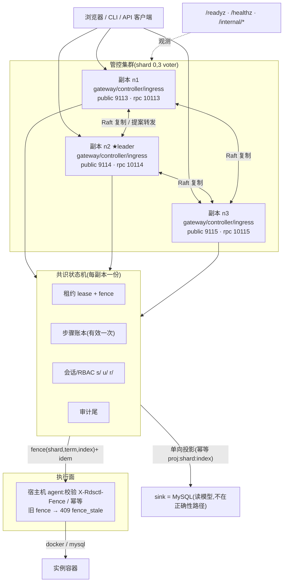
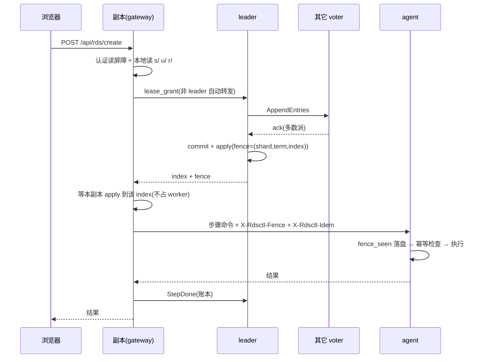

# 管控面高可用拓扑(control-plane-ha-topology)

> 配套:[control-plane-ha-design.md](./control-plane-ha-design.md)(设计与契约)、
> [control-plane-ha-acceptance.md](./control-plane-ha-acceptance.md)(验收锚点)、
> [deployment-architecture.md](./deployment-architecture.md)(部署架构图 / 部署图:部署视角的节点、端口、制品、目录)、
> [ops-guide-cluster.md](./ops-guide-cluster.md)(运维)、
> [control-plane-cluster-view.md](./control-plane-cluster-view.md)(运维面页面)、
> [session-rbac-consensus.md](./session-rbac-consensus.md)(会话/RBAC 入状态机)。
> 本文是**一张图的文字版**:把已实现的机制画出来,并明确标出**尚未实现**的部分。
> 状态:与代码同步(每条都给了函数锚点);M1a 已落地,M1b/M1c 项目在 §7 标明。

图中每条机制都能在代码里指到具体函数;行号随重构会漂移,以**函数名**为准。

---

## 0. 物理与角色总览

```
                   浏览器 / 运维 CLI / 其它 API 客户端
                              │  (连任一入口即可,不需要 sticky session)
        ┌─────────────────────┼─────────────────────┐
        ▼                     ▼                     ▼
┌────────────────┐   ┌────────────────┐   ┌────────────────┐
│ 副本 n1        │   │ 副本 n2        │   │ 副本 n3        │
│ public 9113    │   │ public 9114    │   │ public 9115    │
│ rpc    10113   │◄─►│ rpc    10114   │◄─►│ rpc    10115   │
│ 角色:          │Raft│ 角色:          │Raft│ 角色:          │
│  gateway       │复制│  gateway       │复制│  gateway       │
│  controller    │   │  controller★   │   │  controller    │
│  ingress       │   │  ingress       │   │  ingress       │
└───────┬────────┘   └───────┬────────┘   └───────┬────────┘
        │                    │                    │
        └──────────┬─────────┴──────────┬─────────┘
                   ▼                    ▼
    ┌───────────────────────────┐  ┌──────────────────────────┐
    │ 共识状态机(每副本一份)    │  │ 执行面 agent(宿主 :9413)│
    │  · 租约 lease + fence     │  │  · 校验 X-Rdsctl-Fence    │
    │  · 步骤账本 step ledger   │  │  · fence_seen 落盘后才执行│
    │  · 会话/RBAC  s/ u/ r/    │  │  · 旧 fence → 409 拒绝    │
    │  · 审计尾 audit_tail      │  └──────────────────────────┘
    └─────────────┬─────────────┘
                  │ 单向投影(可重放、幂等)
                  ▼
        ┌──────────────────────────────────────┐
        │ sink = MySQL(读模型/审计/分析)       │
        │ **不在正确性路径**:挂了只影响视图     │
        └──────────────────────────────────────┘
```

`★` = 当前 leader。两条容易误解的地方:

1. **业务 API 由任一副本服务**,不需要把请求路由到 leader。真正的串行化点在**提案层**:
   非 leader 把提案转发给 leader(`src/ha/runtime.rs::ClusterRuntime::propose_op`)。
2. **端口约定**(`scripts/cluster.sh`):公开端口 = `base+i`、RPC 端口 = `base+1000+i`、
   本机 agent = `base+300`。单机多副本开发用 `./scripts/cluster.sh up --lab`。

| 端口 | 提供什么 | 谁访问 |
|---|---|---|
| 公开端口 | 业务 API + `/healthz` + `/readyz`;sink 不可达时**只**提供探针 | 浏览器、LB、守护 |
| RPC 端口 | `/internal/raft`(共识消息)、`/internal/propose`、`/internal/status`、`/internal/view`、`/internal/commit-index`、`/internal/state|lease|step(s)`、`/internal/stepdown` | 集群内部(可选 `X-Cluster-Token`) |

---

## 1. 分层剖析:每层负责什么、凭什么可信

```
┌── 接入层(gateway 角色)────────────────────────────────────────────┐
│ 登录/会话:cookie → sha256 → 认证读屏障 → 本地状态机读 s/ u/ r/     │
│            → 权限每请求现算(改权无需重登)                          │
│ 写请求    :任何副本接收 → 提案转发 leader → 多数派提交后才回 200     │
│ 凭什么可信:屏障(applied≥commit,未追平 503)+ 无多数派一律 503      │
│ 锚点:runtime.rs::auth_barrier / auth_login / wait_visible_on_all    │
└────────────────────────────────────────────────────────────────────┘
┌── 共识层(raft-lite,每副本一份状态机)──────────────────────────────┐
│ 日志:哈希链 + 组提交 fsync;尾部截断容忍、中间损坏拒绝启动          │
│ 快照:原子写 + 自校验哈希 + prev 回退;压实与后缀截断                 │
│ 选举:pre-vote + 显式 Campaign 状态机(避免旧节点打断)              │
│ 提交:多数派 match_index ≥ N 且 entry.term == current_term           │
│ 租约:lease CAS,冲突授予要求 at_ms ≥ old.expire_at + max_skew       │
│ 账本:StepBegin/StepDone(有效一次,重放短路)                        │
│ 时钟:偏移采样窗口(16)+ 最小延迟过滤 + 10s 有效期 + ≥2 样本才判超界 │
│ 锚点:log.rs / snapshot.rs / raft.rs / state.rs                      │
└────────────────────────────────────────────────────────────────────┘
┌── 执行层(agent,宿主机上)─────────────────────────────────────────┐
│ 每条变更命令带 X-Rdsctl-Fence=(shard,term,index)与 X-Rdsctl-Idem   │
│ fence 单调:fence_seen 落盘后才执行;低于已见最高值 → 409 fence_stale│
│ 幂等:同一 idem 键重复到达 → 返回首次结果,不重复副作用              │
│ 强制度:A4 要求 agent 声明 fence_capable;不达标 → 拒绝启动(退出码 2)│
│ 锚点:src/agent.rs、src/ha/fence.rs                                  │
└────────────────────────────────────────────────────────────────────┘
┌── 投影层(sink = MySQL)────────────────────────────────────────────┐
│ leader 每 5s 把日志里的决策投影为审计行,幂等标记 proj:<shard>:<idx> │
│ 重放不重复;`rdsctl admin resync-sink` 或集群页按钮可重置游标       │
│ **不在正确性路径**(C9):不可达时降级为只提供探针 + 内部 RPC         │
│ 锚点:src/ha/projection.rs、main.rs::serve_cluster 的对账循环        │
└────────────────────────────────────────────────────────────────────┘
```

---

## 2. 一次实例操作的完整时序(以创建为例)

```
浏览器     副本 n1(gateway)          leader n2              n3          agent        sink
  │                │                      │                  │             │            │
  │─POST /create──►│                      │                  │             │            │
  │                │ ① 认证:屏障 applied≥commit → 读 s/ u/ r/   │             │            │
  │                │ ② lock_instance      │                  │             │            │
  │                │── lease_grant ──────►│ ③ Raft 提案      │             │            │
  │                │  (非 leader 自动转发) │── AppendEntries ►│             │            │
  │                │                      │◄── ack(多数派)───│             │            │
  │                │                      │ ④ commit + apply │             │            │
  │                │◄─ index + fence ─────│  fence=(shard,term,index)      │            │
  │                │ ⑤ 等**本副本** apply 到该 index(不占 worker)        │            │
  │                │ ⑥ DAG 逐步执行:      │                  │             │            │
  │                │   ledger_begin(StepBegin)──────────────►│             │            │
  │                │   ── 带 fence + idem ─────────────────────────────────►│            │
  │                │                      │                  │  fence 校验 │            │
  │                │                      │                  │  + 幂等落盘 │            │
  │                │                      │                  │◄── 执行结果 ─│            │
  │                │   ledger_done(StepDone)───────────────►│             │            │
  │                │ ⑦ 任务终态 → unlock_instance(释放租约)   │             │            │
  │                │ ⑧ AuditAppend → leader 每 5s 投影 ─────────────────────────────►│
  │◄── 结果/进度 ──│                      │                  │             │            │
```

三个"有效一次"的关口,缺一不可:

| 关口 | 机制 | 防的是什么 | 锚点 |
|---|---|---|---|
| 谁有权做 | 共识租约(lease CAS;冲突授予需 `at_ms ≥ old.expire_at + max_skew`) | 两个副本同时操作同一实例 | `state.rs::Op::LeaseGrant` |
| 做了不算数 | fence `(shard,term,index)` **在资源侧**强制 | 僵尸旧主(GC 停顿/分区恢复)继续写 | `agent.rs` 的 `409 fence_stale` |
| 重放会不会做两遍 | 步骤账本 `StepBegin/StepDone` 有效一次 | 崩溃重放/换主续跑造成重复副作用 | `state.rs::Op::StepBegin/StepDone` |

租约的生命周期(三层收口,见设计 §19 发现 15):

```
授予 ──► 每 100ms 续约(watch_task)──► 任务终态 unlock_instance(主动释放)
  │                                          │
  │ 崩溃/漏释放                               │
  ▼                                          ▼
已过期条目:①该副本每 5s 自愈回收(自己持有 + 已过期 + 本进程未在操作)
           ②holder 永久离场 → leader 用确定性 Op::LeasePurge{cutoff_ms} 回收
             cutoff = 提议时刻 −(max_skew + 宽限 60s),随日志落定、apply 不读本地时钟
```

---

## 3. 读写路径刻意不对称

```
写(强一致,读不起的代价换正确性)
  任一入口 ─► 转发 leader ─► 多数派 commit ─► apply ─► 回 200
                 ▲ 无多数派 = 503 fail-closed,绝不本地写成功

读(本地 + 屏障,零共识往返)
  cookie ─► 认证读屏障(applied ≥ commit;未追平 = 503 auth_not_caught_up)
          ─► 本地状态机读 s/ u/ r/ ─► 权限现算 ─► 路由
```

两处**例外**必须走线性一致读/写(代价只放在低频操作上):

| 操作 | 为什么特殊 | 做法 |
|---|---|---|
| 登录 | 本副本可能还停在旧口令上 ⇒ 越权窗口 | `read_index` 取 leader 的 commit 并等本副本追平,再本地校验口令 |
| 登出/撤销 | 屏障挡不住"**还没学到** commit"的副本 | 写完等 `wait_visible_on_all(index)`:逐成员问 `/internal/commit-index`,等其 `applied_index` 覆盖该 index;不可达成员**如实列出**并说明生效范围 |

---

## 4. 四条不变量(图"为什么可信"的根据)

| 不变量 | 在图上的落点 |
|---|---|
| **C3** fence 单调且在资源侧强制 | 执行层:agent 落盘 `fence_seen` 后才执行,旧 fence → 409 |
| **C4** 单写者:互斥是共识状态 | 共识层:租约在状态机里,判定不读任何单机时钟 |
| **C8** 会话/授权跨副本一致 | 接入层:`s/ u/ r/` 入状态机 + 屏障 + epoch 一次性作废 |
| **C9** sink 不在正确性路径 | 投影层:单向、幂等可重放;不可达只降级视图 |

读路径与前提检查的"诚实标注"同源:`/readyz` 的 `ready` = 多数派可达 + 日志可写 + fsync 可信;
前提是否**已验证**单独上报(`premises_ok` / `premises_unverified[]` / `lab_degraded`),
**lab 放行不等于已满足**(锚点:`runtime.rs::ClusterRuntime::ready`)。

---

## 5. 故障矩阵(每一格都是代码里写死的行为)

| 故障 | 行为 | 依据 |
|---|---|---|
| leader 进程被杀 | 其余副本选主(term+1);新 leader 续跑未完成任务;已完成步骤因账本短路**不重复执行** | F1/F6、I8 |
| 少数派(仅剩 1/3) | `/readyz` → `quorum_unavailable`;**一切写 503**(含登录);不本地写入 | F2、I4 |
| 时钟偏移**持续**超界 | 拒绝**授予**新租约(检查先于 leader 判定);`premises_unverified: A1_clock` | F7 |
| 时钟偏移**抖动/延迟尖峰** | 最小延迟过滤 + 10s 有效期 + 需 ≥2 个样本 ⇒ 不误伤(此前会永久锁死节点) | 发现 22 |
| 单副本收不到 commit | 等待不占 worker + 心跳不被投递拖住 ⇒ 不再出现"已提交但未追平" | 发现 23 |
| 磁盘 / fsync 失败 | `fsync_failed` / `log_unwritable` → 不就绪;启动自检不过 → **退出码 2** | A2、F12 |
| 日志中间损坏(哈希链断) | **拒绝启动**,禁止手工改日志 | `log.rs` |
| 日志尾部截断(异常掉电) | 容忍:丢弃不完整尾记录 + 重放收敛(告警级) | `log.rs` |
| sink(MySQL)不可达 | 正确性不受影响;降级为只提供探针 + 内部 RPC(不假就绪) | C9、I17 |
| sink 投影滞后 | 幂等标记保证重放不重复;`admin resync-sink` / 集群页「重建审计投影」重置游标 | I18/I19 |
| agent 失联 | 节点进入 `remote` **管理盲区**:页面显示"看不了",**不当作"坏了"**,也不喂 ERS | 节点页语义 |
| 前提 A1–A4 有未验证项 | lab 放行 → 启动但持续标注;生产不达标 → 退出码 2 | A1–A4、F12 |

---

## 6. 观测入口:图上每个部件在哪看

| 部件 | 观测点 |
|---|---|
| 本副本就绪/前提/水位 | `/readyz`(`ready`、`quorum_ok`、`log_writable`、`fsync_ok`、`commit_index`、`applied_index`、`premises_ok`、`premises_unverified`、`lab_degraded`、`skew_measured_ms`、`skew_latest_ms`、`skew_samples`、`delivered`、`transport_errors`) |
| 进程存活 | `/healthz` |
| 共识拓扑与状态机规模 | `/internal/status`(`role`/`term`/`leader`/`commit`/`applied`/`snapshot`/`kv_len`/`leases`/`voters`/`data_dir`) |
| 成员全量视图(含 peers) | `/internal/view` |
| 实例租约台账 | `/internal/lease?instance=` · 管控集群页「实例租约台账」 |
| 步骤账本 | `/internal/steps?task_id=` · `/internal/step?...` |
| 会话台账 | 后端 `ClusterRuntime::auth_sessions_view`(尚未做界面) |
| 集群页 | 侧边栏「**管控集群**」:`cluster.view`(观测)/ `cluster.manage`(让位、重建投影) |
| 节点页 | 侧边栏「**节点状态**」:全实例 DB/Proxy 节点 + 就地运维动作 |

---

## 7. 尚未实现 / 刻意未画(别当成已有)

| 项 | 状态 |
|---|---|
| 三档一致性读、通用读的 read-index(登录之外) | ⏳ **I12**(M1c):目前普通读是"本地 + 屏障",不是线性一致读 |
| 普通请求的会话陈旧窗口 | ⏳ 仍 ≤**1 个心跳**(默认 300ms);**登录/登出已消除**(§3) |
| 队列 worker 多副本化 | ⏳ **M1b**(I13/I14):目前靠"仅 leader 续跑 + 账本短路"保证不重复 |
| ingress 自动重绑的线性性(客户端/DNS 切换) | ⏳ **L1–L3**;`ingress` 角色已存在,自动重绑未做完整验证 |
| 会话/RBAC 的混合版本回滚 | ⚠️ 必须走停写流程:旧二进制读新快照会忽略未知字段(RBAC 视为空、会话全失效) |
| sink 调用仍是同步 `mysql` 子进程 | ⚠️ 会占 worker(已知)。若发现 23 修完后仍有卡顿,这是下一个嫌疑点 |
| 成员变更自动化(增删 voter) | ⏳ 设计 §5.6:必须停写重配 |
| 过期租约条目的**彻底** GC | ✅ 已做(自愈 + 确定性 purge);GC 不进审计(内部收敛动作) |

---

## 8. mermaid 版(便于支持渲染的地方)



写入路径(强一致):



---

## 9. 变更记录(与本图有关的两处近期修复)

| 编号 | 问题 | 在图上的位置 | 锚点 |
|---|---|---|---|
| 发现 22 | 把"单程延迟"当成"时钟偏移",并被永久锁死 ⇒ 实例操作全线被拒 | 共识层的"时钟"框 | `raft.rs::skew_exceeded` / `peer_offset_filtered` |
| 发现 23 | 桥接等待占住 tokio worker ⇒ 本副本收不到 commit(已提交却报"未追平")+ 心跳被投递拖住 | 接入层与共识层之间的边界 | `runtime.rs::bridge_block` / `spawn_background` |

两处都新增了回归用例(`ha::raft::tests::delayed_message_is_not_mistaken_for_clock_skew`、
`ha::runtime::tests::bridge_wait_does_not_starve_the_runtime_worker`),后者已验证
"去掉修复必然失败"。
