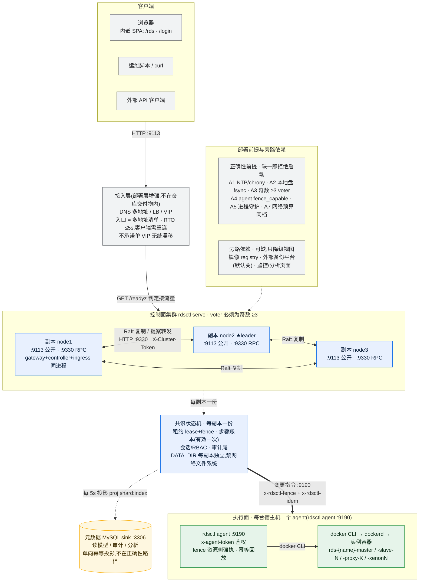
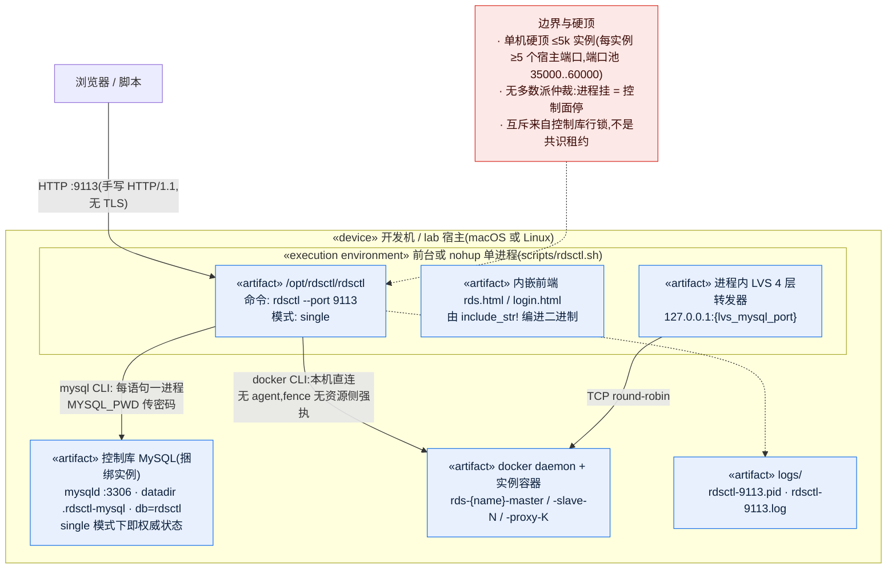
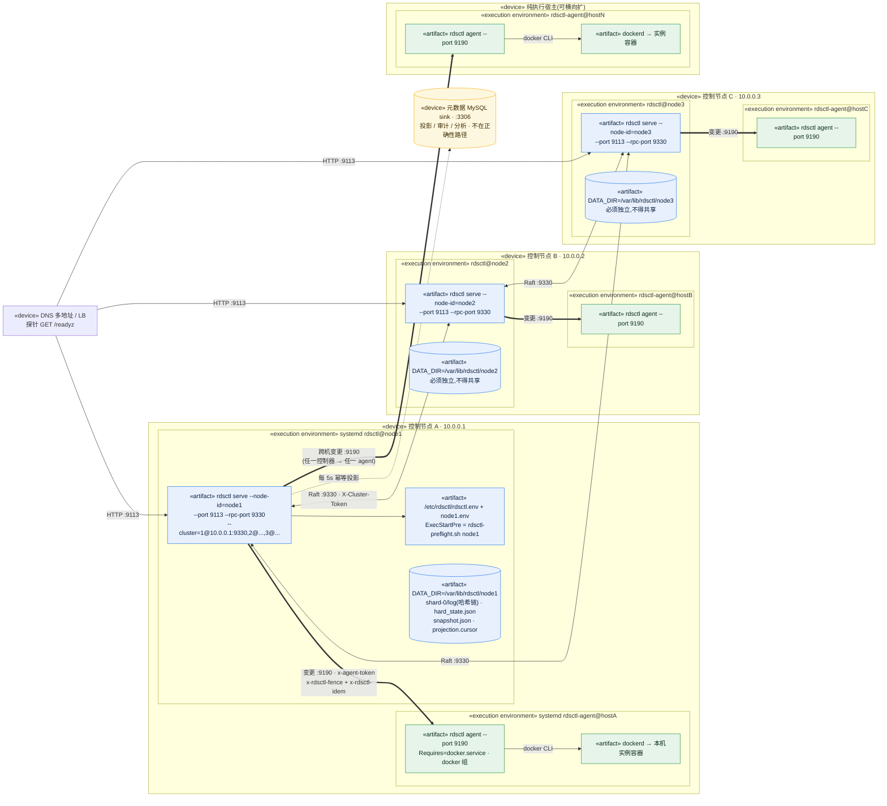
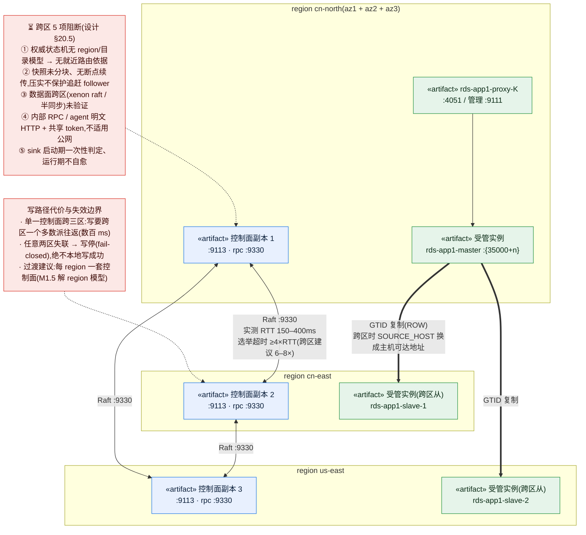
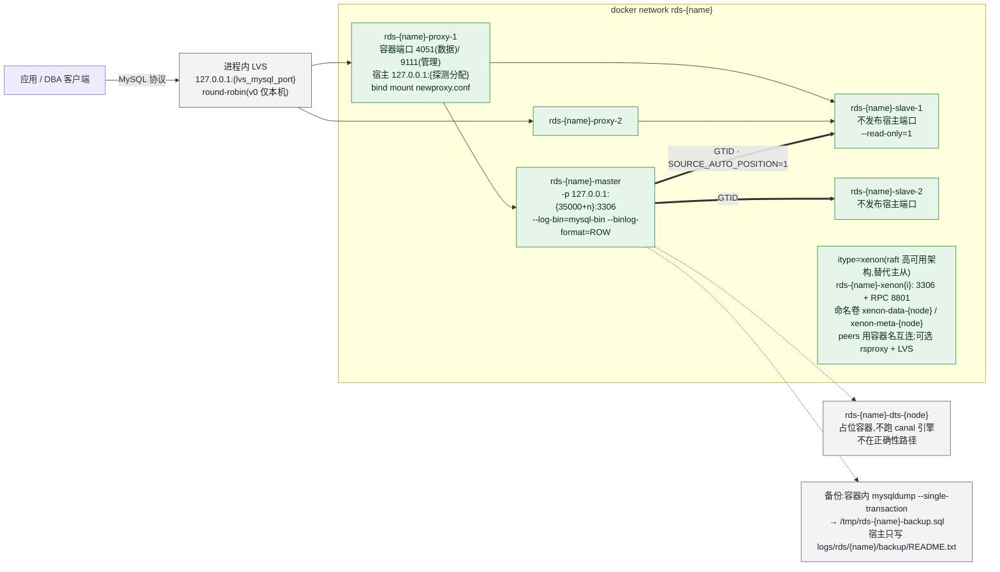

# rdsctl 部署架构图与部署图(deployment-architecture)

> 配套:[deploy/README.md](../deploy/README.md)(部署物 / 守护模板 / 启动自检)、
> [control-plane-ha-design.md](./control-plane-ha-design.md)(契约与正确性前提 A1–A7)、
> [control-plane-ha-topology.md](./control-plane-ha-topology.md)(机制与函数锚点)、
> [ops-guide-cluster.md](./ops-guide-cluster.md)(集群运维)、
> [container-platform-abstraction.md](./container-platform-abstraction.md)(执行后端抽象)、
> [physical-multi-site-ops.md](./physical-multi-site-ops.md)(多站点)、
> [scaling-design.md](./scaling-design.md)(容量与分片)。
>
> 本文交付**部署视角**的两张图:
>
> 1. **部署架构图**(§1):系统怎么分层、谁调用谁、哪些组件在**正确性路径**上;
> 2. **部署图**(§2, UML deployment 风格):节点 `«device»` → 运行环境 `«execution environment»` → 制品 `«artifact»`,
>    以及端口 / 协议 / 鉴权头。
>
> 每条事实都给**代码或文档锚点**;凡"设计已定、代码尚未接线"一律标 **`⏳`**,不得当成已有能力。
> 图片产物见 [`docs/images/deployment/`](./images/deployment/)(Mermaid 源即本文代码块)。

---

## 0. 读图约定

| 约定 | 含义 |
|---|---|
| `-->` | 请求 / 数据的普通链路 |
| `==>` | **变更指令**(带 `x-rdsctl-fence` + `x-rdsctl-idem`),属正确性路径 |
| `-.->` | **旁路**:投影 / 依赖 / 可缺失项。不可达只降级视图,不影响共识正确性 |
| `«device»` | 物理机或虚机节点 |
| `«execution environment»` | 进程运行环境(systemd 单元 / 容器 / 单进程) |
| `«artifact»` | 部署制品:二进制、配置、数据目录、日志 |
| `⏳` | 设计已定义、**代码未接线**(见 §8) |
| `:9113` | 宿主监听端口;`127.0.0.1:` 前缀表示**仅本机可达** |

**口径声明**:仓库内**没有** Dockerfile / docker-compose / k8s manifest(`docker/` 为空目录),
部署物只有 `deploy/{systemd,launchd,bin}` + `scripts/*.sh`;前端页面以 `include_str!` 编进二进制
(`src/http.rs:16-17`)。因此下文的"发布"= 放二进制 + 配置 + 守护单元。

---

## 1. 部署架构图(总览)



> 图片:[`01-architecture-overview.svg`](./images/deployment/01-architecture-overview.svg) ·
> [`01-architecture-overview.png`](./images/deployment/01-architecture-overview.png)

**图 1 要读出来的四件事**:

1. **业务 API 由任一副本服务**,不需要把请求路由到 leader;真正的串行化点在提案层
   (非 leader 自动转发 leader)。所以 LB **不需要 sticky session 也能跑**,但入口必须是"多地址清单"。
2. **控制面 → 执行面是单向 PUSH**:控制面是 HTTP client,agent 是 server。**没有 agent 反连控制面的通道**,
   所以 agent 所在宿主必须能被控制面路由到(`rds_hosts.agent_port`)。
3. **MySQL sink 不在正确性路径**(cluster 模式):它只是读模型。`RDSCTL_METADATA_SINK=none` 时
   部署**完全不需要 MySQL**;但那样公开端口只提供探针 + 内部 RPC(业务 API 未接线,`503`)。
4. **single 模式与 cluster 模式的语义差别**:single 下控制面 MySQL 是**权威**;cluster 下权威是共识日志,
   MySQL 退化为投影。

---

## 2. 部署图(UML deployment 风格)

### 2.1 单机模式(开发 / lab;`rdsctl --port 9113`)



> 图片:[`02-deploy-single.svg`](./images/deployment/02-deploy-single.svg) ·
> [`02-deploy-single.png`](./images/deployment/02-deploy-single.png)

### 2.2 生产三副本集群(多机 · 每节点一个 systemd 单元)



> 图片:[`03-deploy-cluster.svg`](./images/deployment/03-deploy-cluster.svg) ·
> [`03-deploy-cluster.png`](./images/deployment/03-deploy-cluster.png)

> **当前实现口径(`--roles` 现状)**:`gateway` / `controller` / `ingress` 三个角色**只被解析并打印日志**,
> 没有按角色的行为分支(`src/main.rs:114-115,195-199,396-402`)——所以**今天三副本每台都是"三合一"同进程**。
> 其中 `ingress`(入口端口权威分配 / `IngressBind`)属 **M1d ⏳**,今天进程内只有一个本机 `127.0.0.1` 的
> LVS 转发器(`src/lvs.rs`),**跨机入口要靠部署层的 DNS/LB 补**。

### 2.3 跨区多站点(region / az / rack / shard)



> 图片:[`04-deploy-multisite.svg`](./images/deployment/04-deploy-multisite.svg) ·
> [`04-deploy-multisite.png`](./images/deployment/04-deploy-multisite.png)

---

## 3. 受管实例(数据面)容器拓扑



> 图片:[`05-instance-topology.svg`](./images/deployment/05-instance-topology.svg) ·
> [`05-instance-topology.png`](./images/deployment/05-instance-topology.png)

**存储口径(容易踩)**:标准 MySQL 容器**没有任何 `-v` 挂载**,数据落在**容器可写层**
(容器内 `/var/lib/mysql`);全仓只有两处挂载——proxy 配置文件 bind mount、xenon 命名卷。
即**实例数据"跟着容器走"**,`docker rm` 即数据消失;需要持久化/迁移时按
[physical-multi-site-ops.md](./physical-multi-site-ops.md) 的替换/迁移流程处理。

---

## 4. 端口 / 协议 / 鉴权矩阵

### 4.1 监听面

| 进程 / 模式 | 绑定 | 控制项 | 默认 | 锚点 |
|---|---|---|---|---|
| single 管控面 | `0.0.0.0:{PORT}` | `--port` / `-p`(脚本用 `RDSCTL_PORT`) | **9113** | `src/http.rs:40`、`src/main.rs:105` |
| cluster 公开面 | `0.0.0.0:{PORT}` | 同上 | **9113** | `src/main.rs:539-540` |
| cluster 内部 RPC | `0.0.0.0:{RPC}` | `--rpc-port`(脚本用 `RDSCTL_RPC_PORT`) | **9330** | `src/ha/runtime.rs:2101-2103` |
| 执行面 agent | `0.0.0.0:{PORT}` | `agent --port`(systemd 用 `RDSCTL_AGENT_PORT`) | **9190** | `src/agent.rs:53-54` |
| 实例 LVS 转发器 | `127.0.0.1:{lvs_mysql_port}` | 探测式分配 | 35000 起 | `src/lvs.rs:84-90` |

> **两个实操坑(务必按此写部署配置)**
> 1. `RDSCTL_PORT` / `RDSCTL_RPC_PORT` / `RDSCTL_AGENT_PORT` **在 Rust 代码中零引用**——它们只是被
>    `scripts/lib.sh` / systemd 展开成 CLI flag。**直接跑二进制时必须给 flag**,给 env 无效。
> 2. `rdsctl agent` 的默认 9190 **只在 `agent` 后不带任何其它参数时生效**;写成
>    `rdsctl agent --token x` 会退回绑 **9113**。systemd 单元里若 `/etc/rdsctl/<host>.env`
>    漏写 `RDSCTL_AGENT_PORT`,会展开成 `agent --port`(缺值)从而同样退回 9113。

### 4.2 端口布局示例

| 形态 | 公开端口 | RPC 端口 | agent |
|---|---|---|---|
| 单机(single) | 9113 | — | 无(本机直连 docker) |
| 同机三副本 lab(`scripts/cluster.sh`) | 9113 / 9114 / 9115 | 10113 / 10114 / 10115 | 9413(本机 agent) |
| 多机生产(systemd) | 各节点 9113 | 各节点 `IP:9330` | 每宿主 9190 |

`RDSCTL_CLUSTER=1@10.0.0.1:9330,2@10.0.0.2:9330,3@10.0.0.3:9330` 必须**各副本字面一致**,
且 `RDSCTL_NODE_ID` 必须在成员表内、voter 数为**奇数 ≥3**(见 §6)。

### 4.3 接口分组与鉴权

| 分组 | 端口 | 代表性路径 | 鉴权 |
|---|---|---|---|
| 探针(免登录) | 公开 + RPC | `GET /healthz`、`GET /readyz` | 无(鉴权之前返回,供 LB / 守护用) |
| 业务 API | 公开 | `GET/POST /api/rds/*`(实例/任务/查询台/慢查/主机/DTS/集群/审计/RBAC/容量) | Cookie `rdsctl_session`(HttpOnly,8h)+ 每请求现算权限 |
| 认证 | 公开 | `POST /login`、`POST /logout`、`GET /api/auth/me` | 登录页 `/`、`/rds` |
| 内部集群 RPC | RPC | `POST /internal/raft|propose|stepdown`、`GET /internal/status|view|commit-index|state|lease|steps|step` | `X-Cluster-Token`(空 = lab 不鉴权) |
| agent RPC | agent | `GET /agent/ping|caps`;`POST /agent/{create,start,stop,restart,remove,rename,exists,state,health,logs,exec,exec_raw,sql,write_file,network/ensure,network/remove,expose}` | `x-agent-token`(空 = lab 不鉴权) |
| 数据面指标 | 实例宿主 | `GET /api/rds/proxy/metrics`(控制面**代拉**代理管理端口 `/metrics`) | Basic(来自 newproxy.conf) |

**变更指令的强制头**(只在变更端点强制,只读端点不要求):

| 头 | 格式 | 语义 |
|---|---|---|
| `x-rdsctl-fence` | `<shard>:<term>:<index>` | agent 落盘 `fence_seen/<instance>` 并 fsync **之后**才执行;低于已见最高值 → `409 fence_stale`;格式非法 → `400`;缺失且 `RDSCTL_AGENT_FENCE_REQUIRED=1` → `409 fence_required` |
| `x-rdsctl-idem` | 幂等键 | 同键重复到达 → 回放首次成功结果,不重复副作用(结果落盘 `idem/<key>`) |

**安全边界(实现事实)**:全部 HTTP 为**手写 HTTP/1.1、无 TLS**;token 用普通 `==` 比较(非常量时间);
`/internal/propose` 可提交任意 op;session cookie 只有 `HttpOnly`(无 `Secure`/`SameSite`)。
⇒ **RPC 端口与 agent 端口不得暴露到公网**,跨区/公网必须由部署层加隧道或 mTLS 终结
(设计侧对应阻断项 §20.5 ④)。

---

## 5. 制品与目录布局

| 类别 | 路径 | 说明 |
|---|---|---|
| 安装前缀 | `/opt/rdsctl` | 仓库根;`deploy/`、`docs/` 随二进制一起放 |
| 全局配置 | `/etc/rdsctl/rdsctl.env` | 由 `rdsctl.env.example` 复制 |
| 每节点配置 | `/etc/rdsctl/<node>.env` | 端口 / node-id / `RDSCTL_CLUSTER` / `RDSCTL_DATA_DIR` **必须逐节点独立** |
| 服务账号 | `rdsctl`(`-G docker`) | 因需访问容器运行时;`SupplementaryGroups=docker` |
| 共识数据目录 | `/var/lib/rdsctl/<node>`(默认 `./logs/ha/<node_id>`) | `shard-<n>/log`(哈希链日志)、`hard_state.json`、`shard-<n>/snapshot.json` + `snapshot.prev.json`、`shard-<n>/projection.cursor`、`.selfcheck`、`.fsync-probe` |
| agent fence 状态 | `RDSCTL_AGENT_DATA_DIR` → `$RDSCTL_DATA_DIR/agent` → `./logs/ha/agent` | `fence_seen/<key>`(先 fsync 再执行)、`idem/<key>`(幂等回放) |
| 日志 | `/var/log/rdsctl/<node>.log`、`agent-<host>.log` | systemd `append:` |
| 控制库 MySQL | 捆绑:`.rdsctl-mysql`(可 `RDSCTL_MYSQL_DATA_DIR`);外部:`127.0.0.1:3306` / db `rdsctl` | 共 23 张表(`tasks`/`task_nodes`/`audit_log`/`instances`/`users`/`roles`/`rds_hosts`/`rds_dts`/`backup_outbox`/`capacity_samples`/`reports` …) |

**三条硬约束**:
1. **网络文件系统禁止**:preflight 检测到 `nfs|cifs|smbfs|afp|fuse|webdav` → **退出码 2 拒绝启动**(前提 A2)。
2. **数据目录按副本隔离**:日志 / 快照 / fence 状态不可共享。
3. **两套托管方式不得同时管同一进程**:`scripts/*.sh` 的 `nohup`+pid 与 systemd 的 `Restart=always`
   会互相抢进程;同一台机器只保留一种。

---

## 6. 部署前置条件与启动门禁

部署物把它落成了 `deploy/bin/rdsctl-preflight.sh`(systemd `ExecStartPre` 自动调用):

| 退出码 | 含义 | 处置 |
|---|---|---|
| 0 | 前提满足(告警项仍需关注) | 正常启动 |
| **2** | **正确性前提不达标 → 拒绝启动** | 修前提;单元用 `RestartPreventExitStatus=2` 避免无意义重启 |
| 3 | 用法 / 配置错误 | 修配置 |

| # | 检查项 | 前提 | cluster 判定 |
|---|---|---|---|
| 1 | 数据目录可写 / fsync 探测 / 非网络文件系统 | A2 | 不通过 = 拒绝 |
| 2 | 时钟同步(`chronyc` / `timedatectl` / `ntpq`) | A1 | 未同步或**无法判定** = 拒绝 |
| 3 | 成员表:`id@ip:port`、id 不重复、voter 奇数 ≥3 | A3 | 不通过 = 拒绝 |
| 4 | 启动时可构成多数派(可达 peer ≥ ⌈N/2⌉−1) | C2 | 不满足 = 拒绝 |
| 5 | 执行面 agent 可达(`/agent/ping` 且 `fence_capable`) | A4 | 未配置 / 不可达 = 拒绝 |
| 6 | **网络预算**:每 peer 5 次 RPC 取最小 ≤ 选举下限/4;丢包 ≤ `RDSCTL_MAX_PEER_LOSS_PCT` | A7 | 超预算 = 拒绝(打印"建议放大到 ≥N ms") |
| 7 | 公开端口未被占用 | — | 仅告警 |

**lab / 演练的显式放行**(放行即代表前提**未验证**,`/readyz` 会持续标注,不得用于生产):

| 开关 | 放行 | 结果 |
|---|---|---|
| `RDSCTL_PREFLIGHT_ALLOW_UNVERIFIED_CLOCK=1` | A1 时钟 | `premises_unverified: A1_clock` |
| `RDSCTL_ALLOW_SLOW_NETWORK=1` | A7 网络预算 | `premises_unverified: A7_network` |
| `RDSCTL_ALLOW_NO_AGENT=1` | A4 agent fence | 本机直连 docker,失去资源侧强执 |
| `RDSCTL_PREFLIGHT_ALLOW_BOOTSTRAP=1` | C2 首启多数派不齐 | 仅首启 |

**不可放行的结构性项**:voter 表、`data_dir`、fsync(`src/main.rs:345-349`)。

---

## 7. 正确性路径归属(挂了这个组件会怎样)

| 组件 | 在正确性路径? | 挂了会怎样 |
|---|---|---|
| 共识日志 / 快照 / fsync | ✅ | 不就绪;`fsync_failed` / `log_unwritable`;启动自检不过 → **退出码 2** |
| 多数派(≥2/3) | ✅ | `/readyz` → `quorum_unavailable`,**一切写 503**(含登录),绝不本地写成功 |
| 租约 lease + fence | ✅ | 拒绝授予新租约(时钟持续超界时);旧 fence → agent `409` |
| 步骤账本 StepBegin/StepDone | ✅ | 崩溃重放 / 换主续跑不会重复副作用 |
| agent | ✅(变更) | 失联 = **管理盲区 `remote`**:页面显示"看不了",**不当作"坏了"**,也不触发自动 ERS |
| NTP / chrony | ✅ | 时钟未同步 → 拒绝启动;运行期持续超界 → 拒绝授予新租约 |
| 会话 / RBAC(入状态机) | ✅ | 屏障未追平 → `503 auth_not_caught_up` |
| **MySQL sink** | ❌ | 正确性不受影响;公开端口降级为**只提供探针 + 内部 RPC**,不假就绪。⏳ 启动期一次性判定、运行期不自愈 |
| DNS / LB 入口 | ❌ | 换入口即可;入口 host 故障重绑 **RTO ≤5s**(客户端需重连) |
| 镜像 registry | ❌ | 新建实例失败,存量实例不受影响 |
| 外部备份平台 | ❌ | 默认关闭;开启后投递失败走退避重试,不阻断生命周期任务 |
| DTS 占位容器 | ❌ | 无影响(当前不跑 canal 引擎) |
| 监控 / 分析页面 | ❌ | 视图不可用;数据一致性档为 `stale`,页面必须显式标注 |

---

## 8. 守护方式(三选一,勿混用)

| 用途 | 用什么 | 崩溃拉起 | 适合 |
|---|---|---|---|
| 生产 / 长期运行(多机) | `deploy/systemd/rdsctl@.service`、`rdsctl-agent@.service` | ✅ `Restart=always` + `RestartPreventExitStatus=2` | 生产 |
| macOS 开发 / 演练 | `deploy/launchd/com.rdsctl.*.plist` | ✅ `KeepAlive` | 本地演练 |
| 开发 / 单机 lab / 同机多副本 | `scripts/{deploy,rdsctl,cluster,ha-drill}.sh` | ❌ `nohup` + pid 文件 | 反复起停与 drill |

systemd 关键参数:`Type=simple`、`KillSignal=SIGTERM`、`TimeoutStopSec=30`(集群模式需在此内完成让位与落盘)、
`StartLimitIntervalSec=60` + `StartLimitBurst=10`、`StandardOutput/Error=append:/var/log/rdsctl/%i.log`。
**滚动升级规程**:一次只动一个副本,`stepdown → restart → 等 /readyz` `ready:true` 再动下一个
(见 [ops-guide-cluster.md](./ops-guide-cluster.md))。

---

## 9. 现状与设计差距(别把设计当已有)

| 项 | 图上位置 | 状态 |
|---|---|---|
| `--roles=gateway,controller,ingress` 按角色拆分进程 | 图 2 | ⏳ **仅解析 + 打日志,无行为分支**;今天三合一同进程 |
| `ingress` 角色 / `IngressBind` / 入口端口权威分配 | 图 1、2 | ⏳ M1d 未实现;今天只有进程内本机 LVS,跨机入口靠部署层 DNS/LB |
| `--shards` / `RDSCTL_SHARDS` 多分片组 | 图 1 | ⏳ **解析后丢弃**;实际由 `RDSCTL_SHARD_ID`(默认 0)决定单分片 |
| cluster 公开端口业务 API | 图 1 | ⏳ 需 sink 可达才起完整 `http::serve`;否则仅探针 + `/internal/*` → 403、其余 503 |
| 快照分块 / 断点续传 / 压实保护追赶 follower | 图 1、4 | ⏳ 跨区大状态机追赶不可靠 |
| region/目录权威模型(就近路由、分区放置) | 图 4 | ⏳ 缺失 ⇒ 跨区阻断,M1.5 才解 |
| 内部 RPC / agent 加密与强鉴权 | §4.3 | ⏳ 明文 HTTP + 共享 token;公网/跨区必须部署层补隧道或 mTLS |
| sink 运行期自愈 / 连接超时 | §7 | ⏳ 启动期一次性判定、运行期不自愈 |
| `NodeProvider`(Manual/Nova 建机)、`SystemdRuntime` | 图 2、3 | ⏳ 未实现;OpenStack 建机目前人工 |
| 端点抽象 `expose()` / `InstNode.endpoint` | 图 3 | ⏳ 未落地;数据面仍依赖宿主端口 `127.0.0.1:{host_port}` |
| 单 VIP 无缝漂移 | 图 1 | ❌ 明确**不承诺**(keepalived/ipvs 属部署层,不在仓库) |
| DTS 跑 canal / sync 半同步插件 | 图 3 | ⏳ DTS 是占位容器;"半同步"目前仅为语义标注 |

**文档与代码的错位(引用时注意)**:
- `docs/ops-guide-cluster.md §10` 仍把 `serve` / `RDSCTL_MODE=cluster` / `/healthz` / `/readyz` / agent fence
  标为"未实现",但 `src/ha/runtime.rs` 与 `tests/ha_cluster.rs`(真实 3 进程验收)显示**已落地** ⇒ 该表已过期。
- `RDSCTL_LEASE_TTL_MS`、`RDSCTL_UNSAFE_NO_FSYNC` 写在 `rdsctl.env.example` 里,但 **`src/` 与
  `deploy/`、`scripts/` 全部零引用**——只有设计文档提过,别按它们配。
- `RDSCTL_MAX_PEER_RTT_MS`、`RDSCTL_MAX_PEER_LOSS_PCT` **只被 `deploy/bin/rdsctl-preflight.sh` 使用**
  (`:301-333`),`src/` 零引用:进程内自检(`src/ha/runtime.rs`)用的是固定的 `选举下限/4` 预算与 3 次探测。
  ⇒ **脚本门禁与进程内门禁的可调旋钮不是同一套**,排障时别只看一处。
- `src/ha/runtime.rs` 头部注释仍写"cluster 业务 API 一律 503 / M1a 骨架",与 `src/main.rs:539-540` 的
  实际分支(sink 可达即起完整 API)不一致。

---

## 10. 图片产物与重新渲染

| 图 | 源(本文) | 产物 |
|---|---|---|
| 图 1 部署架构总览 | §1 | `docs/images/deployment/01-architecture-overview.{mmd,svg,png}` |
| 图 2 单机模式部署图 | §2.1 | `docs/images/deployment/02-deploy-single.{mmd,svg,png}` |
| 图 3 三副本集群部署图 | §2.2 | `docs/images/deployment/03-deploy-cluster.{mmd,svg,png}` |
| 图 4 跨区多站点部署图 | §2.3 | `docs/images/deployment/04-deploy-multisite.{mmd,svg,png}` |
| 图 5 受管实例容器拓扑 | §3 | `docs/images/deployment/05-instance-topology.{mmd,svg,png}` |

`.mmd` 是从本文代码块抽出的**渲染源**,入库用于比对"图与文是否漂移";`.svg` 用于文档/网页,`.png` 用于 PPT。

重新渲染(需要 Node + 一个可用的 Chrome/Chromium;`mmdc` 为 `@mermaid-js/mermaid-cli`):

```bash
cd <仓库根>

# 1) 安装渲染器(仓库 .gitignore 已忽略 logs/,装在这里不会污染工作区)
(cd logs && mkdir -p .tools && PUPPETEER_SKIP_DOWNLOAD=1 \
  npm install --prefix .tools --cache .tools/.npm-cache @mermaid-js/mermaid-cli)

# 2) puppeteer 配置(容器/CI 里必须 --no-sandbox;executablePath 换成本机 Chrome)
cat > logs/.tools/pp.json <<'EOF'
{ "executablePath": "/Applications/Google Chrome.app/Contents/MacOS/Google Chrome",
  "args": ["--no-sandbox", "--disable-setuid-sandbox", "--disable-dev-shm-usage"] }
EOF

# 3) 从本文抽出 mermaid 代码块(顺序即图 1..5)
python3 - <<'PY'
import re, pathlib
names = ["01-architecture-overview","02-deploy-single","03-deploy-cluster",
         "04-deploy-multisite","05-instance-topology"]
src = pathlib.Path('docs/deployment-architecture.md').read_text(encoding='utf-8')
out = pathlib.Path('docs/images/deployment')
for name, body in zip(names, re.findall(r'```mermaid\n(.*?)```', src, re.S)):
    (out / f"{name}.mmd").write_text(body, encoding='utf-8')
PY

# 4) 渲染(必须经 pp.json 传 --no-sandbox,否则 Chrome 会 "Connection closed")
for f in docs/images/deployment/*.mmd; do
  n=$(basename "$f" .mmd)
  logs/.tools/node_modules/.bin/mmdc -p logs/.tools/pp.json -i "$f" -o "docs/images/deployment/$n.svg"
  logs/.tools/node_modules/.bin/mmdc -p logs/.tools/pp.json -i "$f" -o "docs/images/deployment/$n.png" -w 2400 -b white
done
```

> 图例:HTML/PNG 中的 Mermaid 由 `mmdc` 渲染;GitHub / GitLab / VS Code 会**直接渲染本文代码块**,
> 图片只是给 PPT / 离线文档用。
